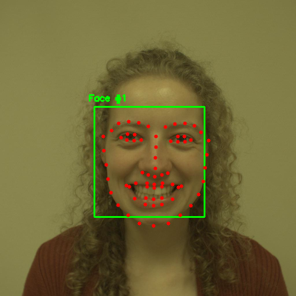
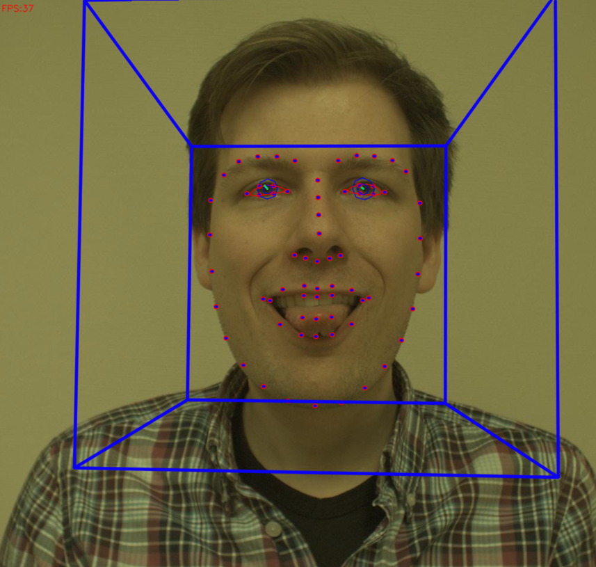
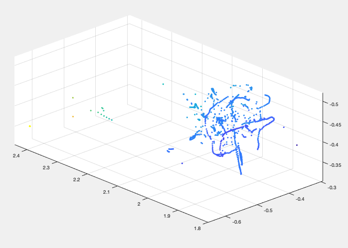
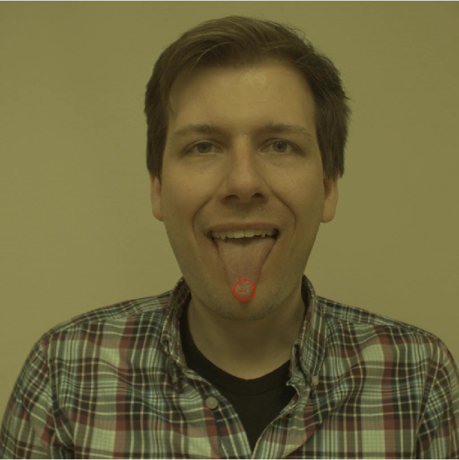

# Optical Flow based Tongue Tip Tracking in 3D

We present a novel method for tracking the tip of tongues in 3-dimensions for medical applications. The repository also includes a report that explains the algorithm in detail and the motivation behind the project.


## Requirements

* `MATLAB 2018b` (It could also work on lower/higher versions) 
* `Python3 Packages` such as opencv, matplotlib, dlib, imutils

## Python3 Implementation

We first use CLNF models to detect faces in an image frame. The model also predicts the face orientation, which helps us in evaluating a 3D box aorund the face, the corrdinates of which are later used for localizing the tongue in 3D.

Constrained Local Neural Fields have been explained in depth in the original research article [here](https://arxiv.org/pdf/1611.08657.pdf)
Face counting has been included in the code. The finetuned model can be downloaded from [here]()
```
python3 facial_landmarks_video.py --shape-predictor shape_predictor_68_face_landmarks_finetuned.dat

```


A 3D visualization has been shown below. This is what we use later.



## MATLAB Implementation
There are two MATLAB codes in this repo. You need to execute `tracking_tongue.m` first and then `tracking_in_3d.m`. You would need to change the name of the video file for execution. This code is meant for video-based tongue tracking and can be extended to real-time video feeds.


The 3D visualization should look something like this. These are the 3D coordinates of the tongue tip, which is tracked using Gunner Farneback's Optical Flow Method. The detected tongue tips are shown below:


For any queries, please feel free to contact me at `kumaar324@gmail.com`
